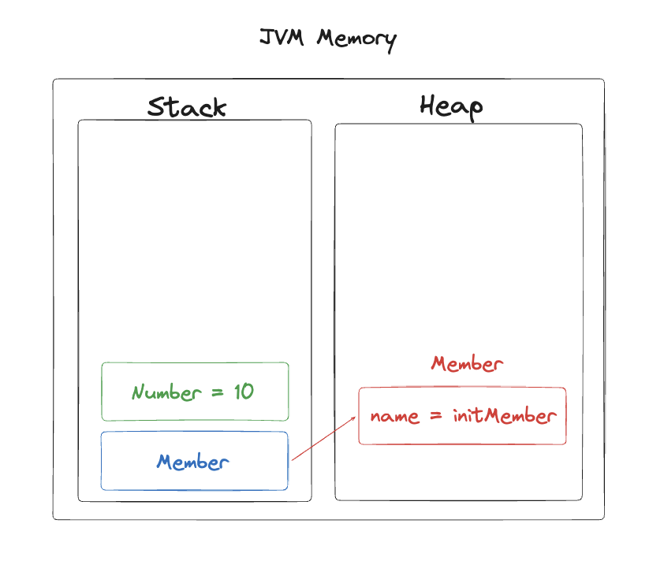
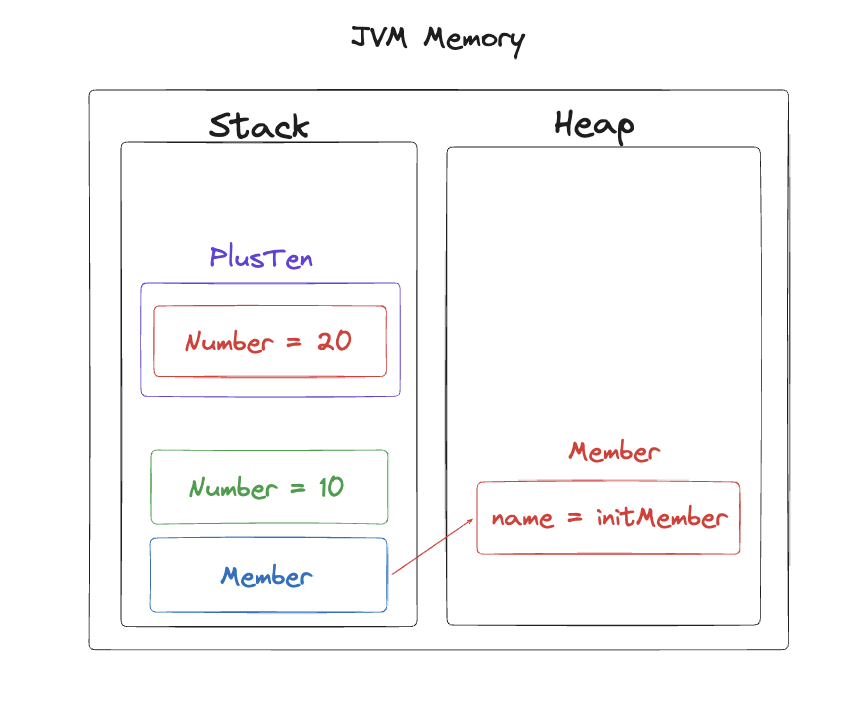
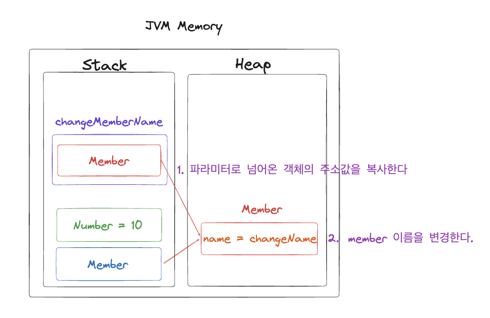
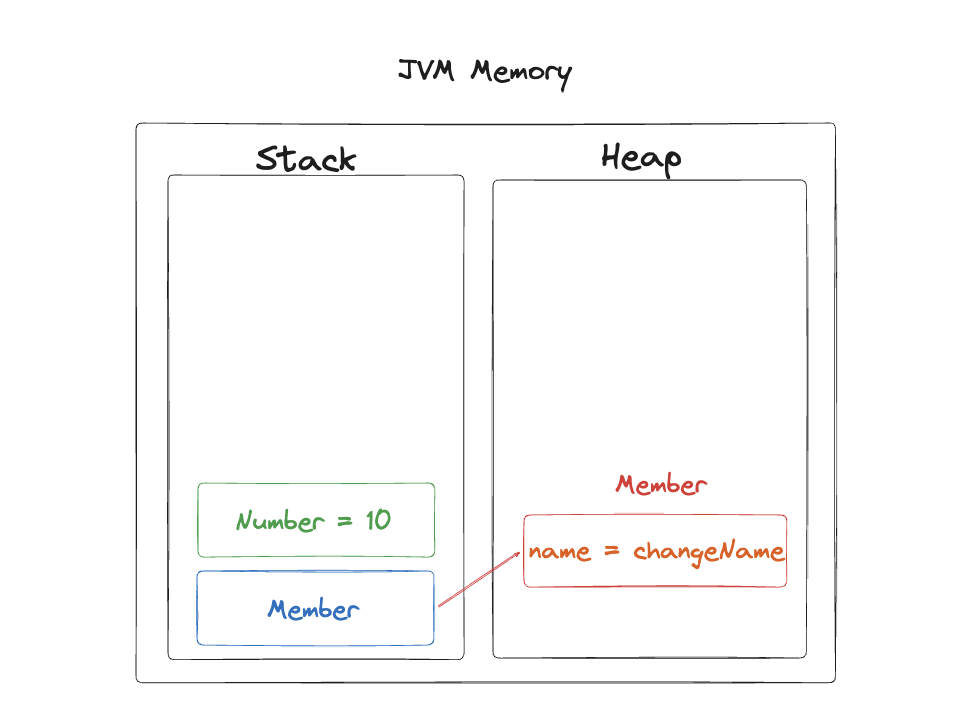

# 자바의 Call By Value
우연히 자바에 대해 이야기를 나누던 중에 call by value와 call by reference에 대해서 접하게 되었습니다.

시작은 아래와 같은 문제였습니다.
```java
public class Test {

    public static void main(String[] args) {
        int number = 10;
        plusTen(number);
        System.out.println(number);
    }

    private static void plusTen(int number) {
        number = number + 10;
    }
}
```

여기서 `System.out.println(number);` 의 결과는 무엇일까? 였습니다.

저는 순간적으로 20? 10? 이라는 것을 고민하기 시작을 했고 찍는다는 생각을 10이라고 맞출 수 있었습니다. 이에 대해서 정확한 정보를 알기 위해서 찾아보던 중 call by value라는 개념을 접하였습니다.

call by value와 call by reference는 함수를 호출 방식이며 이에 대해서 알아보겠습니다.

## Call By Value
Call By Value 방식은 함수를 호출할 때 넘기는 인자의 값이 매개변수에 값이 복사 되어 원래 값에 영향을 미치지 않는 함수 호출 방식입니다.

간단한 테스트를 통해서 알아보겠습니다.(참조 타입과 원시타입 모두 테스트 진행합니다)<br>
**Member 객체**
```java
 class Member {

    String name;

    public Member(String name) {
        this.name = name;
    }

    public void changeName(String changeName) {
        this.name = changeName;
    }
}
```
**CallByValueTest.java**
```java
class CallByTest {

    @Test
    void callByValueTest() {
        // given
        int number = 10;
        Member member = new Member("initMember");

        // when
        plusTen(number);
        changeMemberName(member, "changeName");

        // then
        assertThat(number).isEqualTo(10);
        assertThat(member.name).isEqualTo("changeMember");
    }

    private void plusTen(int number) {
        number += 10;
    }

    private void changeMemberName(Member member, String changeName) {
        member.changeName(changeName);
    }
}
```
위와 같은 테스트 코드를 실행할 때 JVM 메모리 영역에서 어떻게 동작하는지 알아보겠습니다.

테스트 코드 중 given에 해당하는 코드가 동작을 하게 되면 아래와 같이 메모리 영역이 구성됩니다.
```java
int number = 10;
Member member = new Member("initMember");
```
<div style= "text-align: center">
    
</div>
stack 영역에는 primitive의 경우 값을 가지고 저장되고 그 외의 경우에는 변수명(member)이 저장되고 heap에 생성된 인스턴스 주소값을 참조하고 있는다.

이와 같은 상황에서 10을 더해주는 메소드가 실행이 되면 다음과 같이 JVM 메모리 형태는 다음과 같습니다.
```java
plusTen(number);
```
<div style= "text-align: center">
    
</div>
메소드가 실행되면 위의 그림과 같이 PlusTen 스택 프레임에 새로운 변수 Number가 생성되고 값은 20을 가지게 됩니다.(즉, 파라미터로 넘어온 변수의 값 10을 복사하여 메소드를 실행했기에 새로 생긴 변수는 20값을 가진다.) 
이후 PlusTen메소드가 종료되면 새롭게 생선된 변수들은 stack에서 사라지게 됩니다.

다음으로 Member 객체의 이름을 변경하는 메소드가 실행되면 다음과 같은 JVM 형태를 가집니다.
```java
changeMemberName(member, "changeName");
```
<div style= "text-align: center">
    
</div>
changeMemberName 메소드가 실행이 되면 스택 프레임에 member라는 지역변수가 생성이 되고 지역변수는 파라미터로 넘어온 객체의 주소값을 복사하여 참조하게 됩니다. 
그 후 name 필드를 변경합니다. 이번에도 changeMemberName 메소드가 종료되면 stack에서 새롭게 생긴 member 변수가 사라지게 됩니다.

따라서 모든 메소드가 종료된 후에는 아래와 같아집니다.
<div style= "text-align: center">
    
</div>
primitive타입과 reference 타입 모두 값을 복사했지만 primitive 타입의 경우에는 실제 값을 복사했고 reference 타입의 경우 주소 값을 복사했습니다.<br>
따라서 primitive 타입은 변화의 가능성이 없지만 reference 타입의 경우 주소값을 복사하는 얕은복사가 되어 복사본의 변경에 원본이 변경될 수 있습니다.
