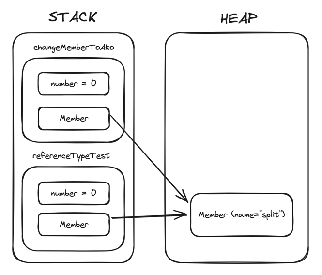
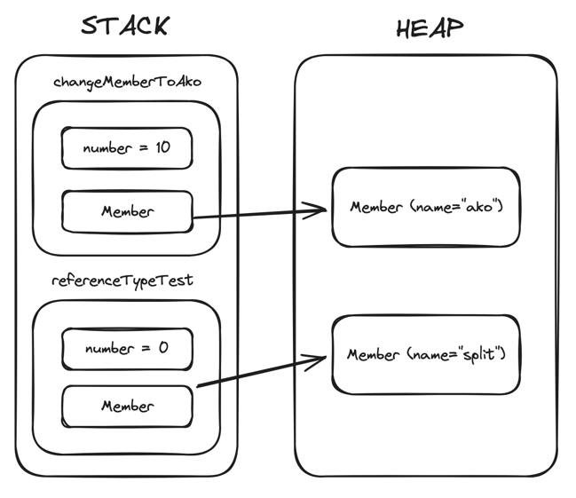

# Call-By-Value 

## [정리된 블로그 글 바로가기](https://not-studying-solving.tistory.com/category/Java)

## Java 의 파라미터 전달 방법

자바는 메서드를 호출할 때 파라미터를 전달하는 방법으로 Call By Value 를 사용합니다. <br>
`Call by Value` 는 파라미터를 전달할 때 변수를 복사하여 전달하기 때문에 전달한 변수와 전달받은 변수는 다른 변수입니다.

## 테스트 코드
```java
class CallByValueTest {

    /**
     * 자바는 메서드를 호출할 때 파라미터를 전달하는 방법으로 Call By Value 를 사용한다.
     *
     * 호출된 함수의 인자는 호출한 함수에서 전달한 변수가 복사되어 있는 변수로 서로 다른 변수입니다.
     * 호출된 함수의 파라미터를 수정해도 호출한 함수가 전달한 변수는 변경되지 않습니다.
     */

    private Member ako = new Member("ako");

    @Test
    void test() {
        //given
        int number = 0;
        Member member = new Member("split");

        //when
        changeMemberToAkoAndNumberTo10(member, number); //number 를 10으로 변경

        //then
        assertThat(member).isNotEqualTo(ako);
        assertThat(number).isNotEqualTo(10);
    }

    private void changeMemberToAkoAndNumberTo10(Member member, int number) {
        member = ako;
        number = 10;
    }

    private static class Member {

        protected String name;

        public Member(final String name) {
            this.name = name;
        }
    }
}
```

### JVM 메모리 변수 저장 위치
Java 에서는 함수에서 사용되는 지역변수, 인자들은 Stack 영역에 저장됩니다.
- 참조 변수는 HEAP 영역에 저장된 뒤에 해당 주소값을 가르키는 변수가 Stack 영역에 저장됩니다.

### 메서드 호출 시 메모리 상태
<div style="text-align: center">
    
</div>

### 메서드 호출 후 메모리 상태
<div style="text-align: center">
    
</div>

## Call-by-Value의 장단점
### 장점
**값을 복사하기 때문에 원래 값의 불변성을 보장합니다.**
만약 메서드에서 변수의 원래값에 접근이 가능하다면 작업중에 다른 메서드에서 변수의 값을 변경하게 되어 문제가 발생할 수 있습니다. 변수에 한개의 메서드만 접근이 가능하도록 하여 해결할 수 있지만 이는 개발 리소스를 추가할 뿐만 아니라 성능 저하를 일으키게 됩니다.

### 단점
값을 복사하기 때문에 메모리 사용량이 늘어납니다.
