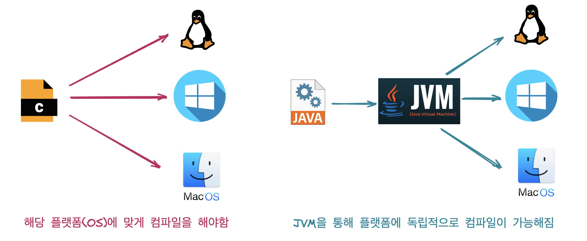
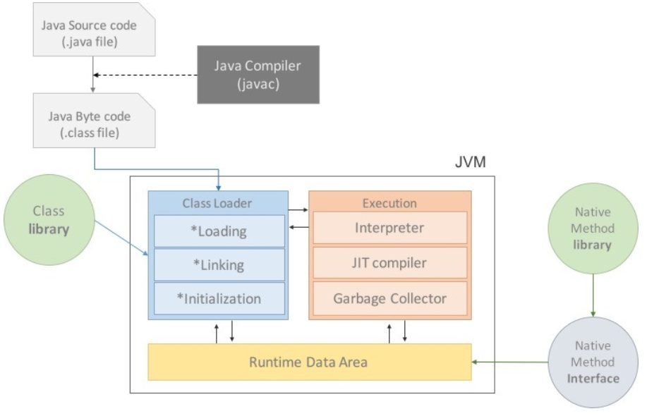
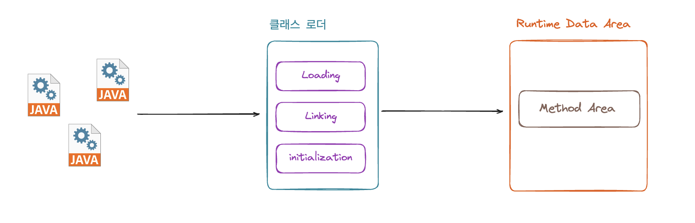
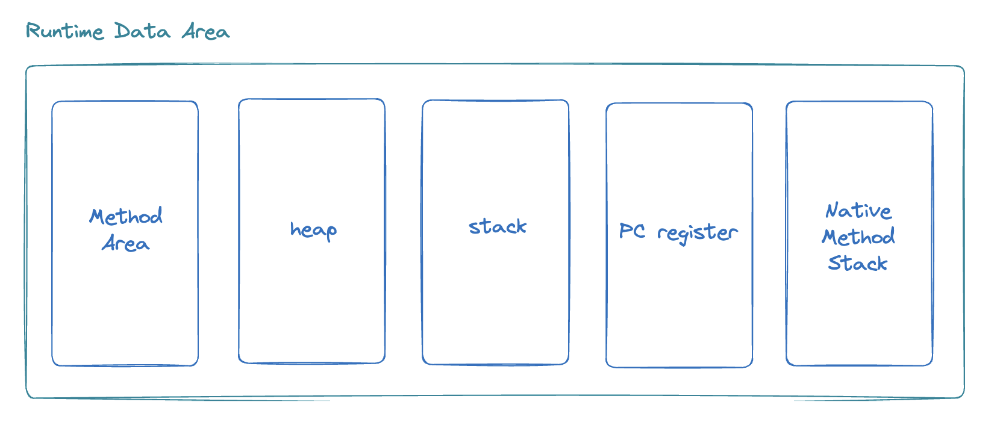
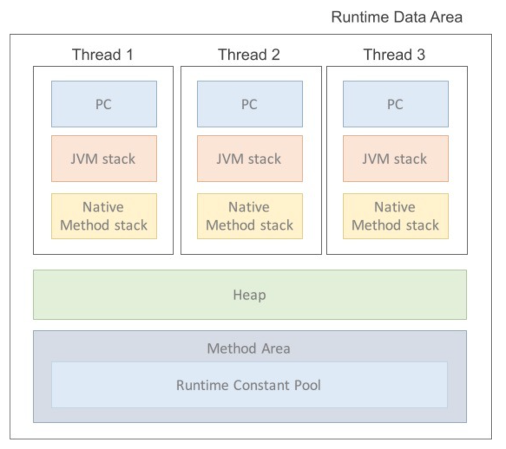

# JVM(Java Virtual Machine)

## JVM 등장 배경

    

C의 경우 컴파일을 후에 파일이 작동이 되는데 이는 운영체제가 다를 경우에는 작동을 하지 않았습니다. 예를 들어 리눅스 기반인 Mac에서 C코드를 작성하고 컴파일을 한 후 Window 노트북에서 컴파일된 파일을 실행시키면 작동하지 않았습니다. 자비는 이를 WORA(Write Once Run Anywhere)를 채택하여 OS에 종속적이지 않고 실행시키기 위해 탄생하였습니다.

> 💡컴파일이란?
컴파일은 프로그래밍에서 소스 코드를 기계어 또는 바이너리 코드로 변환하는 과정을 의미합니다. 즉, 개발자가 작성한 고수준의 언어를 컴퓨터가 이해할 수 있는 저수준의 언어로 변환하는 과정입니다.
>

## JVM의 구조

    

위의 그림과 같이 JVM은 크게 Class Loader, Execution, Runtime Data Area 로 구성되어 있습니다. JVM은 이 3개의 구성요소가 서로 상호작용하면서 동작하는 방식입니다. 

### Class Loader(클래스 로더)

    

Class Loader는 Java 프로그램이 실행될 때 class 파일들을 동적으로 로딩하고, 해당 클래스들을 JVM 내 메모리로 적재하는 역할을 담당합니다. 모든 클래스 정보들이 한번에 메모리로 등록되는 것이 아닌 어플리케이션에서 필요한 경우 동적으로 메모리에 적재됩니다.

프로그램이 실행되면 Class Loader의 경우 Loading(로딩), Linking(링킹), initialization(초기화) 단계를 거칩니다.

- loading(로딩) : 로딩은 클래스 파일을 메모리(Method Area)로 읽어들이는 과정으로 해당 클래스의 이진 형태를 메모리로 로드합니다.
- Linking(링킹) : 링킹은 로딩된 클래스와 다른 클래스 또는 라이브러이와의 연결을 처리하는 과정으로 Verifying, Preparing, Resolving으로 나누어집니다.
    - Veryfying : 클래스 파일의 형식이 올바른지 확인하는 과정입니다.
    - Preparing : 클래스 변수(static 변수)를 위한 메모리를 할당하고 기본값으로 초기화하는 과정입니다.
    - Resolving : 심볼릭 메모리 참조를 실제 메모리 잠조로 교체하는 과정입니다.
- Initialization(초기화) : 클래스의 정적인 요소들을 초기화하여 클래스를 사용할 수 있는 준비를 마치는 과정입니다.

Loading(로딩), Linking(링킹), Initialization(초기화) 과정은 클래스가 처음 사용될 때 한번만 수행됩니다.

### Execution(실행 엔진)

JVM에서 Execution(실행 엔진)은 Java 프로그램의 바이트코드를 해석하고 실행하는 역할입니다. JVM의 실행 엔진에는 Interpreter(인터프리터), JIT(Just-in-Time) 컴파일러와 Garbage Collection로 구성되어 있습니다.

Interpreter(인터프리터)와 JIT 컴파일러는 바이트코드를 읽는 방식이고 Garbage Collection의 경우는 동적 메모리를 최적화하는 역할을 가지고 있습니다.

- Integerpreter(인터프리터) : 인터프리터 방식은 바이트코드를 한 줄씩 읽어서 해당 명령어를 해석하고 실행하는 방식입니다. (다만 반복되는 코드가 있더라고 계속 해석하면서 실행을 해야합니다.)
- JIT 컴파일러 : 인터프리터의 문제를 해결하기 위해 도입된 기술로 프로그램 실행 중에 바이트코드를 네이티브 기계어 코드로 변환하는 역할을 합니다. 또한 반복되서 사용되는 코드의 경우에는 캐시에 저장되어 반복해서 네이티브 기계어 코드로 변환하는 작업을 하지 않습니다.

자바 프로그램이 실행되면 Interpreter(인터프리터)와 JiT 컴파일러 중에 선택해서 동작하는 것이 아닌 이 둘이 적절하게 동작하게 됩니다. 코드가 실행 될 때 초기에는 인터프리터를 통해서 실행하다가 중간에 JIT 컴파일러가 반복되는 코드를 네이티브 기계어 코드로 변화하는 작업을 수행해 반복되는 코드 실행에 대한 성능을 높입니다.

### Runtime Data Area

    

Runtime Data Area는 Java 프로그래밍 실행되는 동안 데이터를 저장하고 관리하는 메모리 영역입니다. 위의 그림과 같이 5가지의 영역(Method Area, Heap, Stack, PC register, Native Method Stack)으로 구성되어 있습니다. 내부 영역은 thread 간에 독립으로 사용되는 공간과 서로 공유하는 공간으로 나누어집니다. 이를 반영해서 다시 보면 아래와 같습니다.

    

위의 그림과 같이 PC register, Stack, Native Method Stack의 경우에는 thread 간 독립적으로 이용하지만 heap 과 method area의 경우는 모든 thread가 공유해서 이용하는 메모리 입니다. 이제 각각에 대해서 알아보겠습니다.

- Method Area : 앞서 Class Loader에서 설명한 것과 같이 클래스에 대한 정보를 바이너리 형태로 저장하고 있는 공간으로 클래스 로딩 시에 메모리에 할당되면 프로그래밍 종료될 때까지 유지됩니다.
- Heap : heap 영역은 동적으로 생성된 객체 인스턴스가 저장되는 영역으로 Excution의 Garbage Collction을 통해서 메모리의 누수를 방지합니다.
- Stack : Stack 영역은 thread 별로 할당되며 지역변스, 메서드 호출 정보, 부분 결과등이 저장되며 이는 스택 프레임이라는 작은 단위로 구성됩니다. 즉, 메소드가 실행되면 하나의 스택 프래임이 생성되고 메소드가 종료되면 스택 프레임은 제거됩니다.
- PC Register : PC Register는 현재 실행 중인 쓰레드의 명령어 주소를 저장하는 영역으로 쓰레드가 다음에 실행할 명령어의 주소를 가리키고 있습니다.
- Native Method Stack : Java 외적으로 구현된 메소드(네이티브 메소드)를 호출하는 경우에 사용도ㅚ는 stack으로 네이티브 메소드의 호출 정보 및 지역변수가 저장됩니다.
