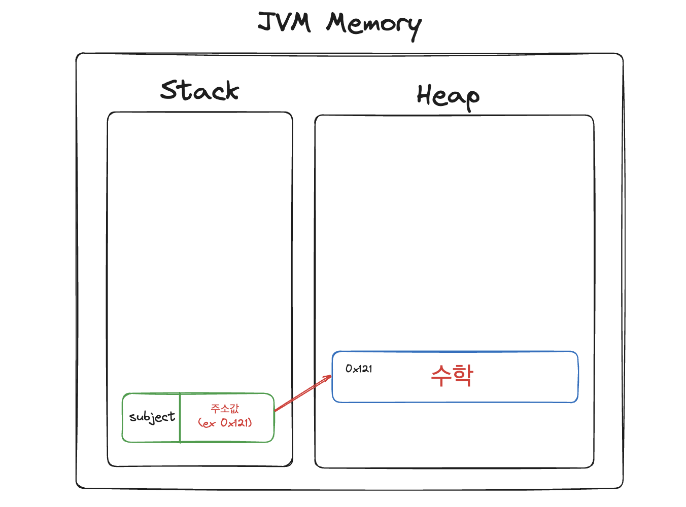
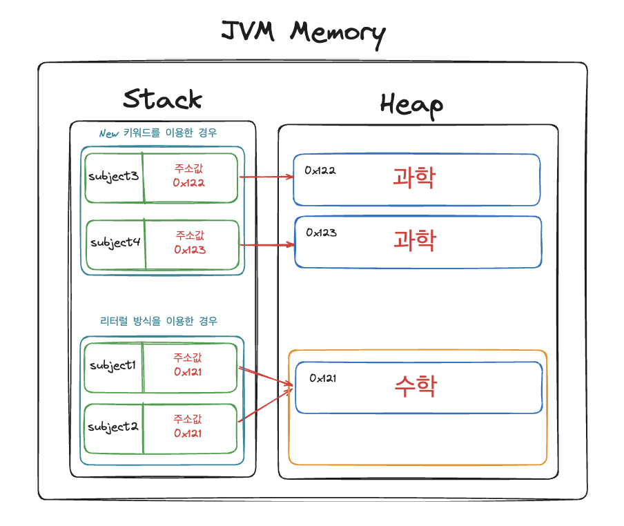
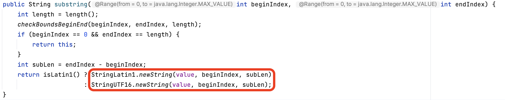
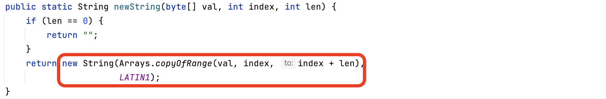
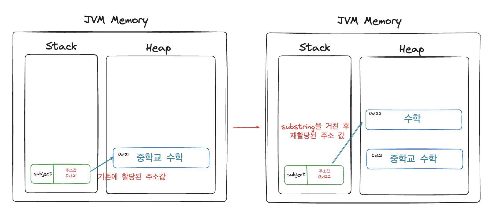
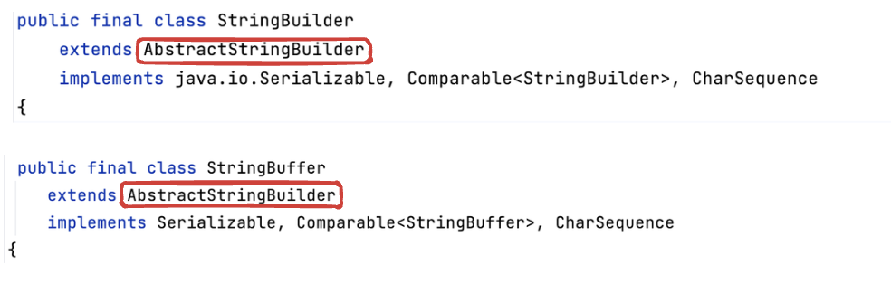
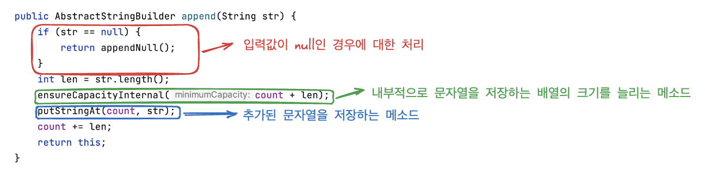
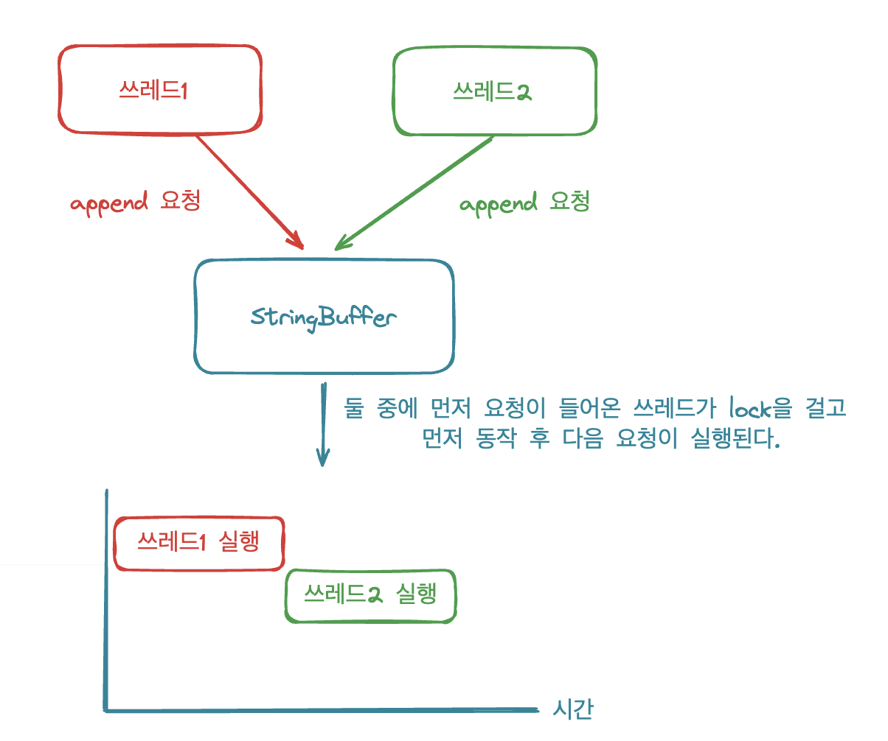
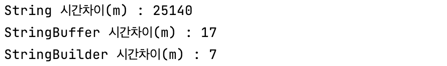

# Stirng-StringBuilder-StringBuffer
자바에서 문자열을 다룰 수 있는 라이브러리는 StringBuilder와 StringBuffer가 존재하고 이 둘의 특징과 차이점에 대해서 알아보겠습니다. 
### String
StringBuilder와 StringBuffer에 대해 알아보기에 앞서서 먼저 String에 대해서 알아보겠습니다. 대부분의 프로그래밍 언어에서 문자열을 관리하고 다루기 위해 String 타입을 이용합니다.

자바에서 String은 참조(reference type) 변수입니다. 그렇기에 Stack 영역에는 변수명과 참조하는 주소값을 가지고 있고 heap 영역에 실제 값을 저장하고 있습니다.
```java
String subject = "수학";
```
<div style= "text-align: center">
    
</div>

### String을 선언하는 방식

자바에서 String을 선언하는 방식은 두가지 방식이 있습니다.

1. 리터럴을 이용하여 String 선언하는 방식
2. new 키워드를 이용하여 String 선언하는 방식

```java
// 리터럴로 생성하는 방식
String subject1 = "수학";
String subject2 = "수학";

// new 키워드를 통해 생성하는 방식
String subject3 = new String("과학");
String subject3 = new String("과학");
```

이 두 방식 모두 heap 영역에 저장되지만 차이점이 존재합니다. 리터럴을 이용하여 선언하는 방식은 heap 영역 내부에 String constant Pool에 저장됩니다. 그래서  같은 문자열 값을 가지는 경우 객체가 새롭게 생성되지 않습니다.
<div style= "text-align: center">
    
</div>
즉, 위의 그림을 보면 알 수 있듯이 리터럴 방식을 이용하면 같은 문자열을 가지는 경우에 메모리를 효율적으로 이용할 수 있습니다.

### String은 불변객체이다

String을 통해서 문자열을 변경하는 작업을 하게 되면 기존 주소 값에 저장된 값이 변경되는 것이 아닌 새로운 객체를 만들고 재할당 해주는 것입니다. 간단한 예시를 보면 다음과 같은 substring 메소드가 있습니다. (substring 메소드는 문자열에서 특정 부분만 추출하는 메소드 입니다.)
<div style= "text-align: center">
    
</div>
여기서 newString 메소드를 확인하면 다음과 같습니다!
<div style= "text-align: center">
    
</div>
최종적으로 새로운 객체를 반환하는 것을 볼 수 있습니다.
<div style= "text-align: center">
    
</div>
String이 불변객체이기 때문에 얻을 수 있는 장점은 멀티스레드 환경에서 동기화처리 없이 객체를 이용할 수 있다는 것입니다. 반면 객체가 변경되어야 할 때마다 새로운 객체가 생성되어야 하기 때문에 메모리 누수가 발생하고 성능저하를 일으키게 됩니다.

그러면 String에서 객체를 새롭게 생성하지 않고 값을 변경할 수 없는 것일까? 이를 가능하게 해준 것이 바로 StringBuilder와 StringBuffer입니다.
### StringBuilder와 StringBuffer

StringBuilder와 StringBuffer의 경우 모두 문자열의 크키가 유연하게 변하는 가변성을 가지고 있습니다. 이 둘 모두 `AbstractStringBuilder` 를 상속을 받고 있습니다.
<div style= "text-align: center">
    
</div>
각각 문자열을 수정(추가)할 때 AbstractStringBuilder의 append 메소드를 활용합니다.
<div style= "text-align: center">
    
</div>
append 메소드는 위의 그림과 같이 동작을 합니다.

1. 먼저 추가되는 str이 null인지 체크하고 처리
2. 문자열을 담고 있는 배열의 크기 조절하기
3. 실제 문자열 값을 저장하기

그러면 StringBuilder와 StringBuffer의 차이는 무엇일까요? 이 둘의 차이는 `동기화 지원여부` 입니다.

StringBuilder의 경우에는 동기화를 지원하지 않는 반면, StringBuffer의 경우 모든 메소드에 synchronized가 붙어 있어 동기화를 지원해 멀티 쓰레드 환경에서도 안전하게 동작하도록 구성되어 있습니다.
<aside>
💡 동기화란?
공유자원을 이용하는 경우에 여러 쓰레드가 접근하여 이용을 하다보면 경쟁조건(race condition)이 발생하고 서로의 결과에 영향을 주기 때문에 이를 방지하는 것입니다.

</aside>
<div style= "text-align: center">
    
</div>
위의 그림과 같이 StringBuffer 공통자원에 쓰래드1과 쓰레드2에서 append 요청이 들어오게 되면 그중에 하나의 쓰레드가 append에 요청을 실행을 하게되면 나머지 쓰레드는 이를 기다리고 앞선 쓰레드에서 요청이 끝나 후에 실행이 가능합니다. 그렇기에 StringBuilder는 멀티쓰레드 환경에서 안정성이 높습니다.

### String, StringBuilder, StringBuffer 성능 비교

실제로 테스트를 통해서 String, StringBuilder, StringBuffer에서 문자열을 변경하는 작업에 수행시간을 비교해보았습니다.

```java
class StringTestTest {

    public static final int TRY_COUNT = 1000000;
    String str = "str";
    StringBuffer stringBuffer = new StringBuffer("str");
    StringBuilder stringBuilder = new StringBuilder("str");

    @Test
    void StringTest() {
        // given
        // when
        // then
        addString();
        addStringByStringBuffer();
        addStringByStringBuilder();
    }

    private void addString() {
        long beforeTime = System.currentTimeMillis();
        for (int i = 0; i < TRY_COUNT; i++) {
            str += "A";
        }
        long afterTime = System.currentTimeMillis();
        long secDiffTime = (afterTime - beforeTime);
        System.out.println("String 시간차이(m) : " + secDiffTime);
    }

    private void addStringByStringBuffer() {
        long beforeTime = System.currentTimeMillis();
        for (int i = 0; i < TRY_COUNT; i++) {
            stringBuffer.append("A");
        }
        long afterTime = System.currentTimeMillis();
        long secDiffTime = (afterTime - beforeTime);
        System.out.println("StringBuffer 시간차이(m) : " + secDiffTime);
    }

    private void addStringByStringBuilder() {
        long beforeTime = System.currentTimeMillis();
        for (int i = 0; i < TRY_COUNT; i++) {
            stringBuilder.append("A");
        }
        long afterTime = System.currentTimeMillis();
        long secDiffTime = (afterTime - beforeTime);
        System.out.println("StringBuilder 시간차이(m) : " + secDiffTime);
    }
}
```

결과는 아래와 같이 나타났습니다.
<div style= "text-align: center">
    
</div>
StringBuilder와 StringBuffer의 경우 성능 면에서 큰 차이가 발생하지 않았지만 String에서 + 연산은 성능이 확연하게 차이가 나는 것을 확인할 수 있었습니다.

### 참고자료

> [자바 String 타입 특징 이해하기 (String Pool & 문자열 비교)](https://inpa.tistory.com/entry/JAVA-%E2%98%95-String-%ED%83%80%EC%9E%85-%ED%95%9C-%EB%88%88%EC%97%90-%EC%9D%B4%ED%95%B4%ED%95%98%EA%B8%B0-String-Pool-%EB%AC%B8%EC%9E%90%EC%97%B4-%EB%B9%84%EA%B5%90)
<br>[[java] Immutable Class (불변 클래스)](https://limkydev.tistory.com/68)
>
