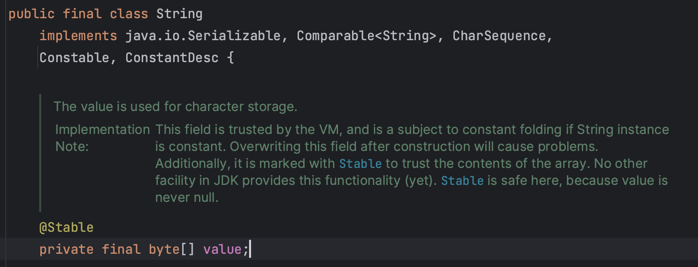
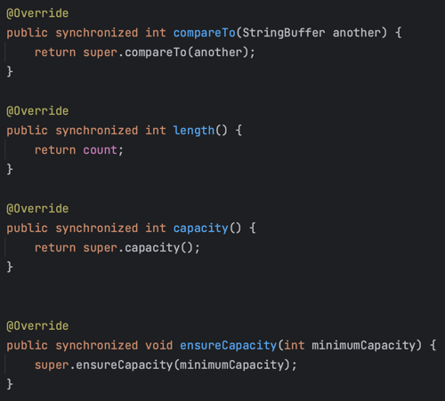

# String, StringBuffer, StringBuilder

## String

String 은 값의 불변을 보장합니다.

값을 저장하는 byte 배열에 final 키워드가 붙어있는 것을 볼 수 있습니다.
<div style="text-align: center">
    
</div>

### String 생성 방식들의 차이

String 을 생성할 수 있는 방식에는 여러개가 있습니다. 
그 중에서 상수로 생성, String.valueOf 메서드로 생성, 생성자로 생성하는 방식의 차이를 알아보겠습니다.

#### 테스트 코드
```java
class StringTest {
    
   @Test
   void stringTest() {
      //given
      //when
      final String constantString = "abc"; //상수로 생성
      final String valueOfString = String.valueOf("abc"); //valueOf 로 생성
      final String newString = new String("abc"); //생성자로 생성

      //then
      //동일성 비교
      assertThat(constantString).isSameAs(valueOfString);
      assertThat(constantString).isNotSameAs(newString);
      assertThat(valueOfString).isNotSameAs(newString);
      //동등성 비교
      assertThat(constantString).isEqualTo(valueOfString);
      assertThat(constantString).isEqualTo(newString);
      assertThat(valueOfString).isEqualTo(newString);
   }
}
```

#### 바이트 코드
```text
   L0
    LINENUMBER 12 L0
    LDC "abc"
    ASTORE 1
   L1
    LINENUMBER 13 L1
    LDC "abc"
    INVOKESTATIC java/lang/String.valueOf (Ljava/lang/Object;)Ljava/lang/String;
    ASTORE 2
   L2
    LINENUMBER 14 L2
    NEW java/lang/String
    DUP
    LDC "abc"
    INVOKESPECIAL java/lang/String.<init> (Ljava/lang/String;)V
    ASTORE 3
```

#### 바이트 코드 명령어 설명
- LDC : 런타임 상수 풀에 상수를 등록하고 오퍼랜드 스텍에 넣습니다. ( 상수 풀에 있는 경우 기존 상수 사용 )
- DUP : 생성된 값을 오퍼렌드 스택의 제일 위에 복제한다.
  - 오퍼랜드 스택 : java 에서 계산의 중간값을 임시로 저장하는 자료 구조
- INVOKESPECIAL : 메서드를 호출한다.
- ASTORE : 지역 변수에 오퍼랜드 스택에 있는 객체 참조를 넣는다.

1. 상수로 생성 바이트코드 내용
   1. "abc" 상수를 스택에 넣는다. ( 상수 풀에 없는 경우 상수 풀에 등록한다. )
   2. 스택에서 꺼낸 "abc" 상수가 있는 참조값을 변수에 저장한다.
2. String.valueOf 로 생성 바이트 코드 내용
   1. "abc" 상수를 스택에 넣는다. ( 상수 풀에 없는 경우 상수 풀에 등록한다. )
   2. String.valueOf 메서드를 호출한다.
      - 스택에서 꺼낸 "abc" 상수가 있는 참조값을 사용한다.
3. 생성자로 생성 바이트 코드 내용
   1. String 객체를 생성한다.
   2. 스택에 객체를 복제하여 넣는다.
   3. "abc" 상수를 스택에 넣는다.
   4. String 클래스의 생성자를 호출한다.
      - 스택에서 꺼낸 String 객체와 "abc" 상수가 있는 참조값을 이용한다.

값이 같은 모든 String은 동등합니다. ( equals() 비교 )
같은 값을 가져도 생성자로 생성한 String 은 동일하지 않습니다. ( == 비교 )
- 상수나, valueOf로 생성한 String 은 상수 풀에 있는 같은 상수의 참조값을 사용하기 때문에 동일성 비교도 통과합니다.

## StringBuffer, StringBuilder
두 가지 모두 불변을 보장하지 않고 내부의 값들이 변경됩니다.

### 특징
StringBuilder 에는 없지만 StringBuffer 의 메서드들에는 synchronized 키워드가 존재합니다.
<div style="text-align: center">
    
</div>

- StringBuffer는 멀티 스레드 환경에서 Thread Safe 하지만 StringBuilder 는 Thread Safe 하지 않습니다.
- 동기화 과정으로 인해 StringBuffer 보다 StringBuilder 가 성능이 좋습니다. ( 차이가 크지는 않음 )

### 테스트 코드

```java
class StringTest {

    @Test
    void stringBufferTest() throws InterruptedException {
        //given
        final StringBuffer stringBuffer = new StringBuffer();
        final CountDownLatch countDownLatch = new CountDownLatch(30000);

        //when
        new Thread(() -> {
            for (int i = 1; i <= 10000; i++) {
                stringBuffer.append("i");
                countDownLatch.countDown();
            }
        }).start();
        new Thread(() -> {
            for (int i = 1; i <= 10000; i++) {
                stringBuffer.append("i");
                countDownLatch.countDown();
            }
        }).start();
        new Thread(() -> {
            for (int i = 1; i <= 10000; i++) {
                stringBuffer.append("i");
                countDownLatch.countDown();
            }
        }).start();
        countDownLatch.await();

        //then
        assertThat(stringBuffer.length()).isEqualTo(30000);
    }

    @Test
    void stringBuilderTest() throws InterruptedException {
        //given
        final StringBuilder stringBuilder = new StringBuilder();
        final CountDownLatch countDownLatch = new CountDownLatch(30000);

        //when
        new Thread(() -> {
            for (int i = 1; i <= 10000; i++) {
                stringBuilder.append("i");
                countDownLatch.countDown();
            }
        }).start();
        new Thread(() -> {
            for (int i = 1; i <= 10000; i++) {
                stringBuilder.append("i");
                countDownLatch.countDown();
            }
        }).start();
        new Thread(() -> {
            for (int i = 1; i <= 10000; i++) {
                stringBuilder.append("i");
                countDownLatch.countDown();
            }
        }).start();
        countDownLatch.await();

        //then
        assertThat(stringBuilder.length()).isNotEqualTo(30000);
    }
}
```
